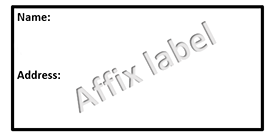

---
output: 
  html_document:
    css: printout.css
params:
  weight: 'NULL'
  GFR: 'NULL'
  thromRisk: "NULL"
  blRisk: "NULL"
  op: "NULL"
--- 
# Managing Oral Antigoagulation for Invasive Procedures

## East and North Hertfordshire NHS Trust

```{r label, echo=FALSE, fig.align='center'}

```

###### Patient's Weight: **`r params[["weight"]]`** Kg

###### Patient's eGFR: **`r params[["GFR"]]`** ml/min

###### Thrombotic Risk: **`r params[["thromRisk"]]`**

###### Surgical Bleeding Risk: **`r params[["blRisk"]]`**

###### Proposed Operation: **`r params[["op"]]`**

### Guideline on Perioperative Bridging of Warfarin

```{r echo = FALSE, message=FALSE, warning=FALSE, results='asis'}
library(knitr)
library(kableExtra)

bridgingInst <- bridgingTable()

kable(bridgingInst, "html", booktabs = T) %>% 
  kable_styling(full_width = TRUE, position = "center") %>% row_spec(0, bold = T) %>% row_spec(7, color = "black", background = "#80c3e8", bold = "T")

```

`r renalText()`

**`r brNote()`**

`r brText1()`

`r brText2()`

`r brText3()`